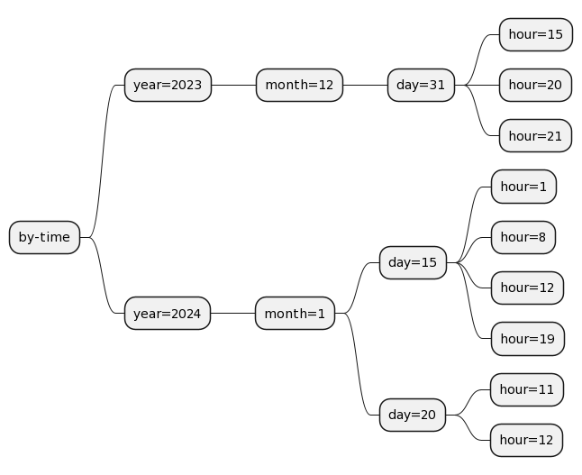
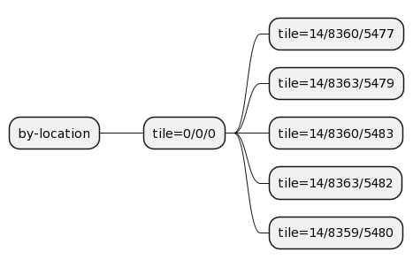
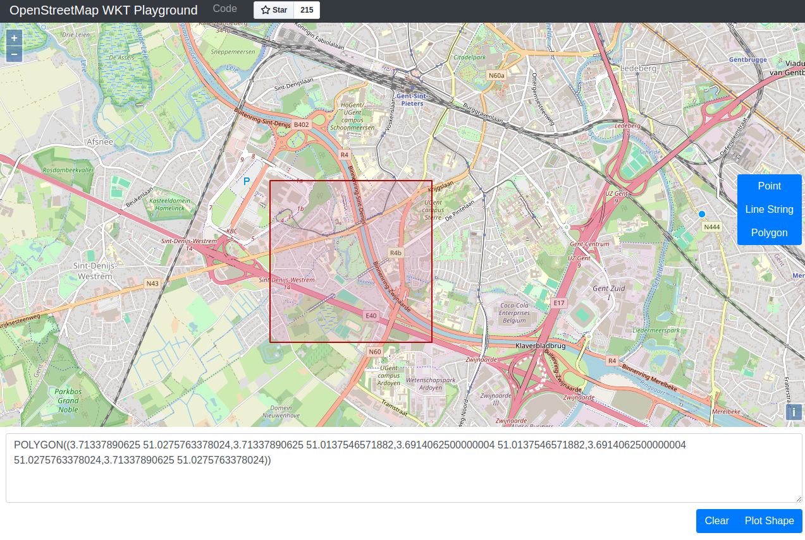
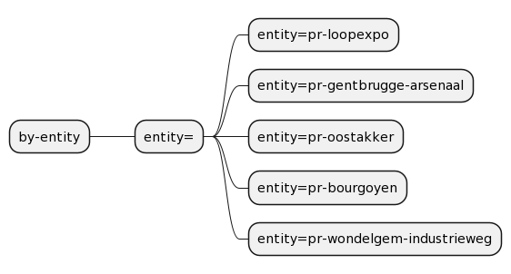
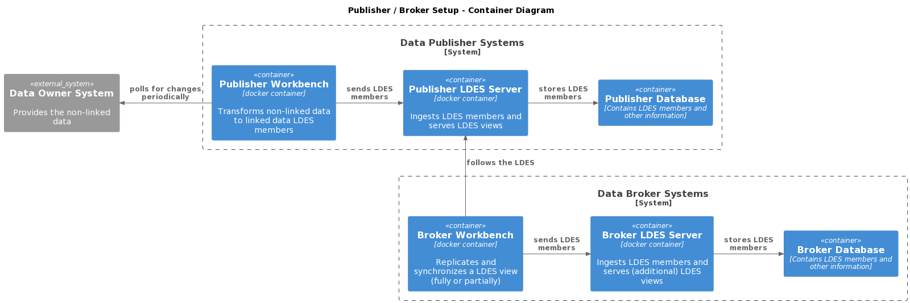

# Republishing an Existing LDES
> **UPDATED** this tutorial has been changed to use Postgres as a data store instead of a MongoDB (which is obsoleted as of [LDES Server version 3.x](https://github.com/Informatievlaanderen/VSDS-LDESServer4J/releases/tag/v3.0.0-alpha)). You can find the previous version [here](https://github.com/Informatievlaanderen/VSDS-Onboarding-Example/tree/v2.0.0/broker-setup).

This tutorial will show you (as a Data Publisher or a Data Broker) how you can offer different views on a LDES while still keeping your storage and bandwidth costs under control. It will show you how these views can be _fragmented_ in one or more ways and how you can control the _retention_ of members of the available data collections.

## Organise, Every Other Day I Organize
When offering data collections as a LDES, a Data Publisher can not know all possible use cases of its Data Clients in advance. Therefore a Data Publisher may simply provide a paged view on the LDES. This allows for fully replicating and synchronizing a LDES in a partitioned way. If such a LDES is based on a data collection that continously grows, a couple of problems may arise.

Depending on the nature of data collection, the LDES may grow slowly or very fast to a large or even huge unmanageable size which increases the storage costs for a Data Publisher. But also for a Data Client this is cumbersome because when the data collection grows, the time needed to replicate the LDES increases as well as the load on the LDES Server which causes bandwidth issues for the Data Publisher. To keep the storage and bandwidth costs under control, the Data Publisher can specify one or more retention policies for each view, in addition to a retention policy on the data collection (LDES) itself. The LDES Server will periodically schedule a _background maintenance job_ which executes a few steps to verify which members should be removed from the views and/or from the LDES itself.

The _retention step_ enforce all retention policies on a view and removes the members for which no retention policy applies from a view fragment. During the _compaction step_ the LDES Server verifies how many members are left in related view fragments after retention policy application and, if needed, compacts these fragments by creating new fragments and putting an expiration time on the old sparsely filled fragments. The _deletion step_ deletes fragments after they expire in addition to deleting any empty fragments. But, most importantly, this task also removes the expired members from the database to ensure costs are kept under control. The periodicity of the maintenance task can be configured in the LDES Server configuration or as an environment variable.

Currently, the LDES Server allows for a retention policy based on keeping members for a limited period of time ([time based retention policy](https://informatievlaanderen.github.io/VSDS-LDESServer4J/configuration/retention-policies/timebased)) and another retention policy based on keeping a number of versions of an entity ([version based retention policy](https://informatievlaanderen.github.io/VSDS-LDESServer4J/configuration/retention-policies/version-based)). You can even combine these. For details see the [Retention Policies](https://informatievlaanderen.github.io/VSDS-LDESServer4J/configuration/retention-policies/index) section of the LDES Server documentation.

> **Note** that the retention policies do not limit what a Data Client can retrieve but instead limit how long members are available. For example, if a retention policy exists with a sliding windows of one week, a LDES Client that starts to follow a LDES today can replicate one week of history, while a Data Client that starts to follow it in a couple of days will not be able to replicated the oldest couple of days anymore as these members will effectively have been deleted (depending on how often the background tasks run).

The process of applying retention policies, the [compaction of fragments](https://informatievlaanderen.github.io/VSDS-LDESServer4J/features/compaction) and the deleting of obsolete members helps to keep the storage size requirements as well as the bandwidth costs under control.

Note that a paged view still requires a LDES CLient to fully replicate and synchronize _all_ members. But sometimes you only need a part of a data set. For this reason the LDES Server offers a few different types of fragmentations.

> **Note** that a paged view is not considered a fragmentation but rather a way to retrieve a data collection fully in parts. In other words, no matter if you fragment or not, you always replicate and synchronize a LDES in a partitioned way.

Currently, the LDES server offers three fragmentation strategies: a fragmentation that structures its members according to a hierarchical division of time (_Timed based Fragmentation_), a fragmentation that organizes its members according to their geographical properties (e. g. location) mapped onto a geo-spatial tiling system (_Geo-spatial Fragmentation_) and a fragmentation which uses a member property that resolves to an object reference effectively grouping members together with the same property value (_Reference Fragmentation_). For details see [LDES Fragmentations](https://informatievlaanderen.github.io/VSDS-LDESServer4J/configuration/fragmentations/index).

> **Note** that the _Reference Fragmentation_ can be used to group members together according to their type(s) allow to replicate and synchronize one type from a multi-typed LDES (i. e. a LDES which contains a data collection with entities of different types).


### Time Is Like a Clock in My Heart
[Time based fragmentation](https://informatievlaanderen.github.io/VSDS-LDESServer4J/configuration/fragmentations/timebased) can be configured with a granularity level set at year, month, etc. up to a second. This creates a hierarchical structure looking like the following (when configured at granularity `hour`):



Fig. 1 - Time based Fragmentation Structure

If you require members limited to a period (e. g. December 2023) you can configure the LDES Client to only follow the subtree for that period.
> **Note** that you should **not** rely on _implicit knowledge_ of the structure (e.g. `/by-time?year=2023&month=12`) of a fragmentation as it can always change in future LDES Server versions. Instead you need to start from the LDES or the view and follow the `tree:relation`(s) comparing the `tree:value` of each relation to the desirable value.

### Around the World, Around the World
[Geo-spatial fragmentation](https://informatievlaanderen.github.io/VSDS-LDESServer4J/configuration/fragmentations/geospatial) is a flat structure containing two levels: a root level (the whole map) and a configurable zoom level. The result is a list of tiles at the configured zoom level (e. g. level 14):



Fig. 2 - Geo-spatial Fragmentation Structure

Similar to the time based fragmentation, if you are only interested in a particular tile containing the members for just a few locations, you can again compare the tile's `tree:value`. This value is a representation of a boundingbox containing these locations. E.g. if you [visualize](https://clydedacruz.github.io/openstreetmap-wkt-playground/) the WKT value for `tile=14/8360/5483` you get:



Fig. 3 - Example Tile Visualization

### Just for Reference, I Stayed the Same
[Reference fragmentation](https://informatievlaanderen.github.io/VSDS-LDESServer4J/configuration/fragmentations/reference) is very similar to the geo-spatial one as it is also only two level: a root level and a list of possible values for the configured property (e. g. all available types, all available entities, all members that have a certain category, etc.). The result looks something like this:



Fig. 4 - Reference Fragmentation Structure

## We’re Trading Places, Let’s Switch Positions
All these retention options and fragmentations are just great but what if the Data Publisher does not offer a fragmentation that you need? Well, your only option then is to do it yourself and create a view with the required fragmentation and retention. But _this_ is exactly what LDES is meant for: an easy way to replicate and synchronize a data collection!

But wait, maybe some Data Broker already had the same problem and already did this? If so, their setup would look something like this:



Fig. 5 - Data Broker Setup

In this tutorial we will show you how to setup the above starting from the [Publishing as a standard open linked data model](./advanced-conversion/README.md) tutorial and combining it partially with the [Setting up a minimal LDES Client](./minimal-client/README.md) tutorial.

As usual, we start by creating a [docker compose file](./docker-compose.yml) containing the services that we need. As you can see in the picture we will need to have a workbench, a server and a database for both the Data Publisher _and_ the Data Broker. We will use two separate networks to separate the Data Publisher and Data Broker environments, but to ease the setup for this tutorial the Data Publisher server and the Data Broker workbench are configured to share both networks. Obviously, in real world setups the Data Publisher's LDES Server would actually be protected behind a API gateway or a reverse proxy and the Data Broker's LDES Client would have to be configured to use some sort of security. See the [Publishing and Accessing a Protected LDES](./protected-setup/README.md) for a very simplified example setup.

We do not need to expose the two databases:
```yaml
publisher-database:
  image: postgres:latest
  environment:
    - POSTGRES_USER=${PUBLISHER_POSTGRES_USER}
    - POSTGRES_PASSWORD=${PUBLISHER_POSTGRES_PWD}
    - POSTGRES_DB=${PUBLISHER_POSTGRES_DB}
  networks:
    - publisher-network
  healthcheck:
    test: pg_isready -U ${PUBLISHER_POSTGRES_USER} -d ${PUBLISHER_POSTGRES_DB}

broker-database:
  image: postgres:latest
  environment:
    - POSTGRES_DB=${BROKER_POSTGRES_DB}
    - POSTGRES_USER=${BROKER_POSTGRES_USER}
    - POSTGRES_PASSWORD=${BROKER_POSTGRES_PWD}
  networks:
    - broker-network
  healthcheck:
    test: pg_isready -U ${BROKER_POSTGRES_USER} -d ${BROKER_POSTGRES_DB}
```

For the Data Publisher, apart from some renaming here and there, both the workbench and server configurations are similar to those from the [Publishing as a standard open linked data model](./advanced-conversion/README.md) tutorial. We use the [same conversion steps](./publisher-workbench/seed/park-n-ride-pipeline.yml) in the workbench and the same setup for the server:
```yaml
publisher-server:
  image: ldes/ldes-server:3.6.1
  volumes:
    - ./publisher-server/application.yml:/application.yml:ro
  ports:
    - 9003:80
  networks:
    - publisher-network
    - broker-network
  depends_on:
    publisher-database:
      condition: service_healthy
  environment:
    - LDESSERVER_HOSTNAME=http://publisher-server/ldes
    - SIS_DATA=/tmp
    - SERVER_PORT=80
    - SERVER_SERVLET_CONTEXTPATH=/ldes
    - SPRING_DATASOURCE_URL=jdbc:postgresql://publisher-database:5432/${PUBLISHER_POSTGRES_DB}
    - SPRING_DATASOURCE_USERNAME=${PUBLISHER_POSTGRES_USER}
    - SPRING_DATASOURCE_PASSWORD=${PUBLISHER_POSTGRES_PWD}
    - SPRING_BATCH_JDBC_INITIALIZESCHEMA=always
    - MANAGEMENT_TRACING_ENABLED=false
    - SPRING_TASK_SCHEDULING_POOL_SIZE=5
    - LDESSERVER_FRAGMENTATIONCRON=*/1 * * * * *
    - LDESSERVER_MAINTENANCECRON=0 0 12 * * * # daily at noon (UTC time)
    - LDESSERVER_COMPACTIONDURATION=P14D
  healthcheck:
    test: ["CMD", "wget", "-qO-", "http://publisher-server/ldes/actuator/health"]
    start_period: 45s


publisher-workbench:
  image: ldes/ldi-orchestrator:2.12.0
  environment:
    - SERVER_PORT=80
  volumes:
    - ./publisher-workbench/application.yml:/ldio/application.yml:ro
  ports:
    - 9004:80
  networks:
    - publisher-network 
  depends_on:
    publisher-server:
      condition: service_healthy
  healthcheck:
    test: ["CMD", "wget", "-qO-", "http://publisher-workbench/actuator/health"]
    start_period: 5s
```

### So Long, I’ve Been Looking Too Hard
The Data Broker workbench is based on a LDES Client which replicates and synchronizes the LDES exposed by the Data Publisher LDES Server (`http://broker-server/ldes/occupancy`). Other than that, the workbench and server services are the same as usual (we did add retention, see [later](#ive-been-waiting-too-long)):
```yaml
broker-server:
  image: ldes/ldes-server:3.6.1
  volumes:
    - ./broker-server/application.yml:/application.yml:ro
  ports:
    - 9001:80
  networks:
    - broker-network
  depends_on:
    broker-database:
      condition: service_healthy
  environment:
    - LDESSERVER_HOSTNAME=http://localhost:9001/ldes
    - SIS_DATA=/tmp
    - SERVER_PORT=80
    - SERVER_SERVLET_CONTEXTPATH=/ldes
    - SPRING_DATASOURCE_URL=jdbc:postgresql://broker-database:5432/${BROKER_POSTGRES_DB}
    - SPRING_DATASOURCE_USERNAME=${BROKER_POSTGRES_USER}
    - SPRING_DATASOURCE_PASSWORD=${BROKER_POSTGRES_PWD}
    - SPRING_BATCH_JDBC_INITIALIZESCHEMA=always
    - MANAGEMENT_TRACING_ENABLED=false
    - SPRING_TASK_SCHEDULING_POOL_SIZE=5
    - LDESSERVER_FRAGMENTATIONCRON=*/30 * * * * * # every 30 seconds
    - LDESSERVER_MAINTENANCECRON=0 */3 * * * * # every 3 minutes
    - LDESSERVER_COMPACTIONDURATION=PT5M # keep only 5 minutes
  healthcheck:
    test: ["CMD", "wget", "-qO-", "http://broker-server/ldes/actuator/health"]
    start_period: 45s


broker-workbench:
  image: ldes/ldi-orchestrator:2.12.0
  environment:
    - SERVER_PORT=80
  volumes:
    - ./broker-workbench/application.yml:/ldio/application.yml:ro
  ports:
    - 9002:80
  networks:
    - publisher-network
    - broker-network
  depends_on:
    broker-server:
      condition: service_healthy
  healthcheck:
    test: ["CMD", "wget", "-qO-", "http://broker-workbench/actuator/health"]
    start_period: 5s
```

> **Note** that the Data Broker exposes the LDES to your local system in order to allow us to verify it. The Data Publisher LDES is only available from within the private docker network as we do not need direct access to it.

For the Data Broker workbench we start from the pipeline as defined in [Setting up a minimal LDES Client](./minimal-client/README.md) but we add one transformation step which will allow us to add a view later that is [geo-spatially fragmented](#around-the-world-around-the-world):
```yaml
transformers:
  - name: Ldio:SparqlConstructTransformer
    config:
      query: |
        PREFIX rdf:          <http://www.w3.org/1999/02/22-rdf-syntax-ns#>
        PREFIX mv:           <http://schema.mobivoc.org/#>
        PREFIX geo:          <http://www.w3.org/2003/01/geo/wgs84_pos#>
        PREFIX locn:         <http://www.w3.org/ns/locn#>
        PREFIX sf:           <http://www.opengis.net/ont/sf#>
        PREFIX geosparql:    <http://www.opengis.net/ont/geosparql#>
        PREFIX spatial-f:    <http://jena.apache.org/function/spatial#>

        CONSTRUCT {
          ?id locn:geometry ?geometry .
          ?geometry a sf:Point ; geosparql:asWKT ?wkt .
        } WHERE {
          ?id rdf:type mv:ParkingLot .
          ?id geo:lat ?lat .
          ?id geo:long ?long .
          bind(bnode() as ?geometry) .
          bind(spatial-f:convertLatLon(?lat, ?long) as ?wkt) .
        }
      infer: true
```

The transformation step takes the latitude and the longitude properties, creates a new blank node and uses a [built-in filter function](https://jena.apache.org/documentation/geosparql/#filter-functions) to format these properties as a [Well Known Text](https://en.wikipedia.org/wiki/Well-known_text_representation_of_geometry) (WKT) literal and adds a `locn:geometry` property which is a `sf:Point` having a `geosparql:asWKT` with our WKT value.

> **Note** that in the SPARQL construct we only add these properties and that we do not need to copy the other data. This is possible because in the transformation step we specified that the transformation is cumulative (`infer: true`).

The resulting [workbench pipeline](./broker-workbench/seed/client-pipeline.yml) then send the modified members to the Data Broker LDES Server (`endpoint: http://broker-server/ldes/occupancy`).

### I’ve Been Waiting Too Long
OK, we have not been completely honest with you: we did change the LDES view configuration of the Data Publisher a bit because in real-life you will never want to create a LDES which grows indefinitely, would you? We added a retention policy with a sliding window (of one year) on the LDES definition by adding a retention policy::
```text
</occupancy> a ldes:EventStream ;
  ...
  ldes:eventSource [
		a ldes:EventSource ;
		ldes:retentionPolicy [
			a ldes:DurationAgoPolicy ;
			tree:value "P9M"^^xsd:duration
		]
	]
.
```
This will ensure that members older than one year are effectively deleted by the background maintenance task. As said [earlier](#organise-every-other-day-i-organise), this allows a Data Client which starts following the LDES to always have a history of data. Now, we can leave things this way and consequently a view will also provide access to all existing members for as long as they are not deleted. However, we can choose to add a retention policy on the view as well to offer less data. Adding such a retention policy is again very simple as we only need to add the following to a [view definition](./publisher-server/definitions/occupancy.by-page.ttl):
```text
</occupancy/by-page> a tree:Node ; 
  tree:viewDescription [ 
    ...
    ldes:retentionPolicy [
      a ldes:DurationAgoPolicy ;
      tree:value "P9M"^^xsd:duration
    ]
  ] .
```

The real added-value we offer in the Data Broker are the _additional fragmentations_. We do not offer a paged view because the original LDES already offers such a view with a big history. Instead, we add fragmentations that allow our Data Clients to partially replicate and synchronize the data collection. Say what, _partially_? Yes, _partially_. The essence of a LDES view is that it always contains _all_ members of the data collection, no matter how it is fragmented (or simply partitioned using a paged view). So, if a client needs all members there is no point in using any of our views as you can get them from the original Data Publisher's paged view. But, of course, if you need a smaller subset of the data collection then our views are ideal. Well, it depends. It depends on how much history we offer and how much you need. So, which views do we add and how much history do we offer? Obviously this is a business decision which depends on your needs and your client's needs. You need to decide this balancing the cost of storage, the cost of the bandwidth, the cost of hosting, your price policy if you do not offer this service for free, etc. For this tutorial we add three fragmentations to show how to configure the different fragmentations and retention policies and how this influences the server's behavior for cleaning up the views and data collection.

Our first fragmentation is one [by time](#time-is-like-a-clock-in-my-heart) allowing a client to retrieve the occupancy of our parking lots for a particular time interval (i.e. January 2024). Depending on when a client starts following our view it will only replicate the data collection partially (if the time period has already elapsed) or it will in addition also synchronize with the new occupancy values until the end of the time period. Our view definition looks like this (only showing the relevant parts, see the [by-time definition](./broker-server/definitions/occupancy.by-time.ttl) for the complete picture):
```text
tree:fragmentationStrategy ([
  a tree:HierarchicalTimeBasedFragmentation ;
  tree:maxGranularity "hour" ;
  tree:fragmentationPath dcterms:modified ;
]) ;

tree:pageSize "50"^^xsd:integer ;

ldes:retentionPolicy [
  a ldes:DurationAgoPolicy ;
  tree:value "PT7M"^^xsd:duration ;
]
```
> **Notes**:
> * the `tree:fragmentationStrategy` is a list `(...)` containing one fragmentation `[...]` of type `tree:HierarchicalTimeBasedFragmentation` which groups together (_bucketizing_) members by property `tree:fragmentationPath dcterms:modified` organizing it in a structure up to `tree:maxGranularity "hour"`.
> * we set the `tree:pageSize` of the view to 50 members which does not affect our structure nodes but does limit the number of members returned per page node.
> * for this view we chose to offer at most 7 minutes of data by definiting a sliding time window retention policy `ldes:DurationAgoPolicy` with the `tree:value` specified as a [ISO8601 duration](https://en.wikipedia.org/wiki/ISO_8601#Durations).

In addition, we add a [by-location definition](./broker-server/definitions/occupancy.by-location.ttl) to allow retrieving a part of the data collection [by location](#around-the-world-around-the-world). The relevant parts are:
```text
tree:fragmentationStrategy ([
  a tree:GeospatialFragmentation ;
  tree:maxZoom "14"^^xsd:integer ;
  tree:fragmentationPath geosparql:asWKT 
]) ;

tree:pageSize "100"^^xsd:integer ;

ldes:retentionPolicy [
  a ldes:DurationAgoPolicy ;
  tree:value "PT5M"^^xsd:duration ;
]
```
> **Notes**:
> * we define a `tree:GeospatialFragmentation` at `tree:maxZoom "14"^^xsd:integer` (zoom level) based on a `tree:fragmentationPath geosparql:asWKT` property. Remember we added this property in a [transformation](./broker-workbench/config/occupancy-add-location.rq)?
> * we chose a `tree:pageSize` of 100 this time (just because we can).
> * again, we chose time fragmentation based on a sliding time window (of 5 minutes).

Finally, we also allow to retrieve data of a single parking lot by using its idenfier. For that we use a [reference fragmentation](#just-for-reference-i-stayed-the-same) and configure a [by-parking definition](./broker-server/definitions/occupancy.by-parking.ttl):
```text
tree:fragmentationStrategy ([
  a tree:ReferenceFragmentation ;
  tree:fragmentationPath terms:isVersionOf ; 
  tree:fragmentationKey "parking-lot"
]) ;

tree:pageSize "15"^^xsd:integer ;

ldes:retentionPolicy [
  a ldes:LatestVersionSubset ;
  ldes:amount 3 ;
]
```
> **Notes**:
> * this time we use a `tree:ReferenceFragmentation` on the member's `terms:isVersionOf` property and use `parking-lot` in the URLs.
> * we limit the history to the most recent occupancy values by using using retention policy `ldes:LatestVersionSubset` with `ldes:amount 3`.
> * we keep at most 15 members per parking lot and fit all of them into one page by setting `tree:pageSize "15"^^xsd:integer`.
> * if we do not set the retention job to run frequently, we may end up with a lot more versions than we configured so please ensure you balance these correctly.

### Let Me Tell You ’Bout Hard Work
Although typically we send our view definitions to the LDES server before ingesting our data collection this is _not_ actually needed. As soon as we have defined our LDES the server can start ingesting the members. But, unless we define a view, the ingested members are inaccessible. They will be ingested into the server's database and stay there forever without anyone being able to retrieve them. Not very useful. So we need to define at least one view. If this view does not specify a retention policy the data collection becomes available but will continue to grow indefinitely. At some point our storage and bandwidth costs will rise to an unacceptable amount and guess who will get fired?! OK, so we add a retention policy to our view as shown earlier. Crisis diverted! 

So, we now know that we can add and remove views as we see fit at any time. Now what happens if we add multiple views to our server? How do the different retention policies interact? How long will our members be available in each view and when will they actually be removed from the server's database to save storage space?

The rules are simple: when all retention policies of a view do not apply to a member (e. g. it is older than the view's retention time or it is not part of the set of latest versions) then that member is removed from all fragments for that view. The retention step is responsible for checking the retention policies and removing the members from the view. Removing members from a view's fragment(s) results after some time in half-empty or even empty fragments. These empty fragments are marked as expired and the partially filled fragments are joined together. This is done by the compaction step. Finally, the deletion step runs to cleanup all expired fragments.

You may wonder when the members are actually deleted. In fact, while the view definition defines the retention policies for the members in a view and as such defines how long a member is part of a view, the event source definition of the LDES itself specifies the retention policies for the members and defines how long a member is physically stored. So the retention policies on the LDES (event source) are needed to actually release storage space. And as you may expect, the deletion step will cleanup all expired members as well.

> **Note** that if you mark the retention of members in the LDES (event source) to be shorter that the retention on its views, obviously the members will be physically deleted and as such also removed from all views of that LDES. So, please ensure you define your event source policies to keep the members at least as long as needed by the LDES views.

The background task running the above steps (retention, compaction and deletion) has a predefined schedule but we can change the default configuration in the LDES Server [application configuration](./publisher-server/application.yml) using a [cron pattern](https://docs.spring.io/spring-framework/docs/current/javadoc-api/org/springframework/scheduling/support/CronExpression.html#method-detail). Here is an example:
```yaml
ldes-server:

  # checks the retention policy on view members (removing obsolete members from the view)
  # compacts data fragments (creating new combined fragments, expiring the old ones) 
  # removes expired and empty data fragments and members
  maintenance-cron: "0 0 4 * * 7" # run weekly at 04:00 on Sundays
  compaction-duration: P5D # time period to keep the old fragments
```

> **Note** that we also added a `compaction-duration` which defines how long the obsolete sparsely filled fragments are kept around before actually being deleted. We need to do this to ensure that any Data Client following a view (at the fragments being compacted) had enough time to catch up with the stream so that we can safely remove the obsolete fragments without breaking some Data Client's flow.

> **Note** that you need to balance the schedule configurations correctly as the steps put some load on your systems when the amount of members increases.

Summarized, you need to create at least one view to allow retrieving a data collection. You need to add a retention policy to the LDES in order to ensure members can be actually deleted (i. e. if only the views have a retention policy, members are never deleted!). The retention policies keeps your storage under control by allowing removal of members from the view's fragments and from the database. Retention policy enforcement, fragment compaction and member deletion are done in a background maintenance task which is scheduled according to a customizable schedule.

> **Note** that a view may contain more versions of an object or older members than specified until the retention is enforced by running the maintenance task as defined by its schedule.

### Parole, Parole, Parole
Enough theory, its show-time!

For this tutorial we defined the retention periods of the views as follows:
* for the by-location view we use 5 minutes
* for the by-time view we use 7 minutes
* for the by-reference view we keep the last 3 versions

To ensure members are not physically deleted too soon, we used both the longest time-based and the version-based one, so keeping at least 3 versions of a member and keeping all members for at least 7 minutes:
```text
ldes:eventSource [
  a ldes:EventSource ;
  ldes:retentionPolicy [
    a ldes:DurationAgoPolicy ;
    tree:value "PT7M"^^xsd:duration ;
  ],[
    a ldes:LatestVersionSubset ;
    ldes:amount 3 ;
  ]
]
```
To demonstrate all the aspects of retention, compaction and deletion we run our background job every 3 minutes and expire the sparse fragments after 5 minutes:
```yaml
- LDESSERVER_MAINTENANCECRON=0 */3 * * * * # every 3 minutes
- LDESSERVER_COMPACTIONDURATION=PT5M # keep only 5 minutes
```

## Launch Systems & Check Views

To see our Data Broker setup in action, you can use the following:
```bash
clear

# start and wait for the servers and databases
docker compose up -d --wait
```
followed by:
```bash
# upload Data Publisher LDES & view definitions
curl -X POST -H "content-type: text/turtle" "http://localhost:9003/ldes/admin/api/v1/eventstreams" -d "@./publisher-server/definitions/occupancy.ttl"
curl -X POST -H "content-type: text/turtle" "http://localhost:9003/ldes/admin/api/v1/eventstreams/occupancy/views" -d "@./publisher-server/definitions/occupancy.by-page.ttl"

# upload Data Broker LDES & view definitions
curl -X POST -H "content-type: text/turtle" "http://localhost:9001/ldes/admin/api/v1/eventstreams" -d "@./broker-server/definitions/occupancy.ttl"
curl -X POST -H "content-type: text/turtle" "http://localhost:9001/ldes/admin/api/v1/eventstreams/occupancy/views" -d "@./broker-server/definitions/occupancy.by-time.ttl"
curl -X POST -H "content-type: text/turtle" "http://localhost:9001/ldes/admin/api/v1/eventstreams/occupancy/views" -d "@./broker-server/definitions/occupancy.by-location.ttl"
curl -X POST -H "content-type: text/turtle" "http://localhost:9001/ldes/admin/api/v1/eventstreams/occupancy/views" -d "@./broker-server/definitions/occupancy.by-parking.ttl"
```
and finally:
```bash
# seed the publisher and broker workbench pipelines
curl -X POST -H "content-type: application/yaml" http://localhost:9004/admin/api/v1/pipeline --data-binary @./publisher-workbench/seed/park-n-ride-pipeline.yml
curl -X POST -H "content-type: application/yaml" http://localhost:9002/admin/api/v1/pipeline --data-binary @./broker-workbench/seed/client-pipeline.yml
```

You can already check the existence of our additional Data Broker views using:
```bash
clear
curl http://localhost:9001/ldes/occupancy/by-time
curl http://localhost:9001/ldes/occupancy/by-location
curl http://localhost:9001/ldes/occupancy/by-parking
```

After a bit of time data will start appearing in these views. Replicating the history of the Data Publisher data collection will be almost instantaneous in our case because we just started the Data Publisher's systems. After that the synchronization happens almost immediately as well because the source data produces at most 5 members per minute. Basically, you should see all views grow by at most 5 members every minute (as the data may not have changed). E.g.:

```bash
curl http://localhost:9001/ldes/occupancy/by-parking?parking-lot=

# following the tree:node in the tree:relation eventually results in a fragment like this:
curl "http://localhost:9001/ldes/occupancy/by-parking?parking-lot=https%3A%2F%2Fstad.gent%2Fnl%2Fmobiliteit-openbare-werken%2Fparkeren%2Fpark-and-ride-pr%2Fpr-loopexpo&pageNumber=1"
```

>  **Notes**:
> * in order to show you the retention, compaction and deletion in action we have lowered the retention periods to minutes and increased the frequency of the background tasks
> * keep the system running for at least 7 minutes to see the members disappear from the views and from the system
> * make sure that you hard refresh (press `CTRL-SHIFT F5`) your browser window to by-pass the browser page caching

## Cleanup
To stop all systems:
```bash
docker compose down
```
