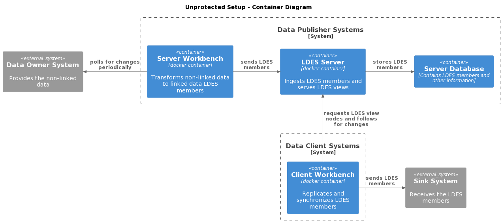
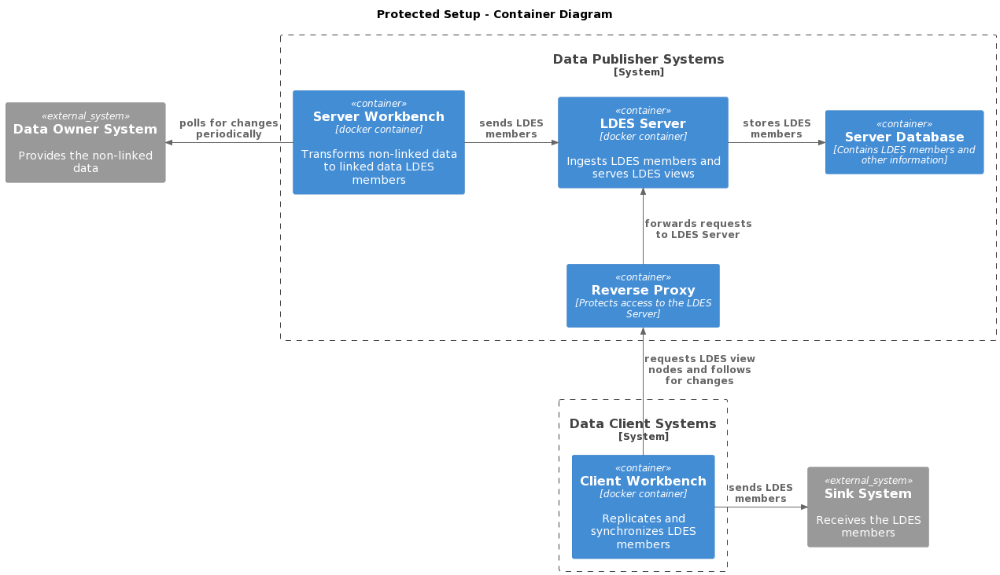

# Publishing and Accessing a Protected LDES
This tutorial will show you how to protect a LDES in order to prevent unauthorized access to a proprietary (or a public) data collection. It will also show how to expose the available LDES Server API as well as add and expose some metadata (using DCAT). In addition it will show you how to access such a protected LDES.

Please see the [introduction](../README.md) for the example data set and pre-requisites, as well as an overview of all examples.

## I’ll Protect You From the Hooded Claw
The LDES Server allows you to ingest a data collection and offers one or more views which allows replicating the data collection in whole or a part of it. However, not all data collection can be made publicly available. You need to protect those data collection in some way to prevent unauthorized access. What you will typically do is configure some security system which expects a Data Client to identify itself (_authentication_) after which the security system verifies it the Data Client has access to the requested data (_authorization_).

The LDES Server does not include such a security system because there are various ways for doing authentication anad authorization and no one-size fits all. You may want to protect the data simply with an API key (secret key shared with a Data Client), using OAuth2 (authorization only) and/or OpenID (based on OAuth2 adding authentication), etc. There are many open-source and commercial implementations available for these and other protocols, so we decided to not include this aspect into the LDES Server. This keeps the server lean and simple for serving open data collections.

But, even if you have a open data collection you may want to add a security layer to it to keep usage statistics per Data Client, e.g. to enforce fair usage policies, etc. So, we will look into how you can protect a LDES using a simple API key per Data Client and how the Data Client can access such a LDES.

This technique may also apply to a commercial data collection: as a Data Publisher you may also want to offer a part of your data to the public for publicity and marketing reasons but of course you will want to track its usage.

We will show how you can protect a LDES and what changes are needed to retrieve such a LDES. We will use existing tutorials to kickstart our setup. To create and feed our LDES we can use the [advanced conversion setup](../advanced-conversion/README.md) and to retrieve it we can use the [minimal client](../minimal-client/README.md). Later we will add a reverse proxy to shield the LDES Server from the outside and configure things in such a way that we have controlled access to both LDES Server administration and LDES replication & synchronization. Obviously we will have to make changes on both the Data Publisher and the Data Client side.

But first, let us setup the system without access limitation first to ensure everything works fine. As usual, we start by creating a docker compose file containing the services that we need.

At the Data Publisher side we need a database for the LDES Server (`ldes-mongodb`), the LDES Server itself (`ldes-server`) and a workbench to feed the LDES Server (`server-workbench`). We can basically copy/paste the services from the [advanced conversion docker compose](../advanced-conversion/docker-compose.yml) file:

```yaml
ldes-mongodb:
  container_name: protected-setup_ldes-mongodb
  image: mongo:latest
  ports:
    - 27017:27017
  networks:
    - protected-setup

ldes-server:
  container_name: protected-setup_ldes-server
  image: ldes/ldes-server:2.10.0-SNAPSHOT # you can safely change this to the latest 2.x.y version
  volumes:
    - ./ldes-server/application.yml:/application.yml:ro
  ports:
    - 9003:80
  networks:
    - protected-setup
  depends_on:
    - ldes-mongodb
  environment:
    - MANAGEMENT_TRACING_ENABLED=false # TODO: remove this when pull-based tracing implemented
    - LDES_SERVER_HOST_NAME=${LDES_SERVER_HOST_NAME:-http://localhost:9003/ldes}

server-workbench:
  container_name: protected-setup_server-workbench
  image: ldes/ldi-orchestrator:2.0.0-SNAPSHOT # you can safely change this to the latest 1.x.y version
  volumes:
    - ./server-workbench/config:/ldio/config:ro
    - ./server-workbench/application.yml:/ldio/application.yml:ro
  ports:
    - 9004:80
  networks:
    - protected-setup 
  profiles:
    - delay-started
```

> **Notes**:
> * for clarity we renamed the network as well as the container names
> * we also renamed the workbench in order to stress that this is the workbench which feeds the LDES Server
> * we moved the configuration files to organize the setup a bit
> * we added an environment variable `LDES_SERVER_HOST_NAME` to allow changing the `ldes-server.host-name` in the [server configuration](./ldes-server/application.yml) easier

At the Data Client side we only need a workbench (`client-workbench`) which we can borrow from the [minimal client docker compose](../minimal-client/docker-compose.yml) file:

```yaml
client-workbench:
  container_name: protected-setup_client-workbench
  image: ldes/ldi-orchestrator:2.0.0-SNAPSHOT # you can safely change this to the latest 1.x.y version
  environment:
    - LDES_SERVER_URL=${LDES_SERVER_URL:-http://localhost:9003/ldes/occupancy/by-page}
    - SINK_URL=${SINK_URL}
    - MAX_REQUESTS_PER_MINUTE=${MAX_REQUESTS_PER_MINUTE:-50}
  volumes:
    - ./client-workbench/application.yml:/ldio/application.yml:ro
  network_mode: "host"
  profiles:
    - delay-started
```

> **Notes**
> * we renamed the container and the service
> * we moved the configuration files
> * we added a profile to prevent the client workbench to start ahead of time

> **Note** that the client workbench uses the network of the host which is completely disconnected from the internal docker network used by the LDES Server and its database and workbench. The LDES Client component therefore needs to use the host name (`localhost`) and exposed server port (`9003`) to access the LDES. That is why we have configured both the `LDES_SERVER_HOST_NAME` and the `LDES_SERVER_URL` to start with `http://localhost:9003/`.

What we have now is illustrated in the following system container diagram:


Fig. 1 - Unprotected setup

At this point we can run all the systems and verify that we receive the LDES members in the sink. Please open https://webhook.site/ in a browser windows and copy your unique URL. Copy the `.env` file to `user.env` and fill in your unique URL as the sink URL. Now start all systems using (in a bash shell):
```bash
clear

# start and wait for the server and database systems
docker compose up -d
while ! docker logs $(docker ps -q -f "name=ldes-server$") 2> /dev/null | grep 'Started Application in' ; do sleep 1; done

# define the LDES and the view
curl -X POST -H "content-type: text/turtle" "http://localhost:9003/ldes/admin/api/v1/eventstreams" -d "@./ldes-server/definitions/occupancy.ttl"
curl -X POST -H "content-type: text/turtle" "http://localhost:9003/ldes/admin/api/v1/eventstreams/occupancy/views" -d "@./ldes-server/definitions/occupancy.by-page.ttl"

# start and wait for the server workbench
docker compose up server-workbench -d
while ! docker logs $(docker ps -q -f "name=server-workbench$") 2> /dev/null | grep 'Started Application in' ; do sleep 1; done

# start and wait for the client workbench
docker compose --env-file user.env up client-workbench -d
while ! docker logs $(docker ps -q -f "name=client-workbench$") 2> /dev/null | grep 'Started Application in' ; do sleep 1; done
```

Once you have verified that the members appear in the sink you can shutdown the systems and remove the private network for now using:
```bash
docker compose rm client-workbench --stop --force --volumes
docker compose rm server-workbench --stop --force --volumes
docker compose down
```

## It’s a Well Kept Secret
Now that we have a unprotected but working setup we can make the necessary changes to enforce security. We will need to do a few things:
* add a reverse proxy that will accept the LDES requests on the server's behalf, check authentication & authorization and forward the request or return an access error
* not expose the LDES Server outside of the internal docker network so that the only way to access it is through the reverse proxy
* change the Data Client (and Data Publisher) configuration to retrieve the LDES through the reverse proxy

The following illustration shows the setup after adding such a reverse proxy:


Fig. 2 - Protected setup

The first thing we need to asks ourselves is which endpoints we need to protect but before we can answer that question we need to know what endpoints are available. By default, the LDES Server does not make that immediately apparant but by exposing the so called [Swagger UI](https://swagger.io) we can make the available API visible. If we add the following to the server configuration and launch it, we should see it:
```yaml
springdoc:
  swagger-ui:
    path: /admin/doc/v1/swagger
    urlsPrimaryName: base
```

> **Note** that we expose our swagger UI on the 'admin' API so we can protect it together with the rest of the admin API later.

The `path` allows us to define the endpoint where the API information is visualized and the `urlsPrimaryName` allows us to choose which collection of APIs are displayed by default when we browse to the swagger UI endpoint. Now, in order to see it, we need to launch the server again:
```bash
clear
docker compose up -d
while ! docker logs $(docker ps -q -f "name=ldes-server$") 2> /dev/null | grep 'Started Application in' ; do sleep 1; done
```

Once started point your browser to http://localhost:9003/ldes/admin/doc/v1/swagger. You will be redirected to http://localhost:9003/ldes/admin/doc/v1/swagger-ui/index.html and in the top right corner you should see the `base` API collection selected and the base API displayed in the main window.

When we look at this base API, we see that there is one endpoint for the ingest that expects a `POST` to an endpoint. Obviously we do not want anybody else than the server workbench to push members to our ingest endpoint so we need to disallow this through the reverse proxy. We can do that by disallowing `POST` requests through the reverse proxy but we need to ensure that we can still seed the LDES definitions, which also use `POST` requests towards the administrative API.

Next we see that the LDES Server exposes an endpoint to retrieve metadata at the root `/` as well as the various data collections at `/{collection-name}` and their respective views at  `/{collection-name}/{view-name}`, all using `GET` requests. Most likely we want the metadata to be publicly accessible so that our available data collections can be discovered. In other words, we want metadata crawlers to be able to retrieve the metadata (typically [DCAT](https://en.wikipedia.org/wiki/Data_Catalog_Vocabulary) information) in an unsecured way so that we get some exposure for our data collections. Now, as for the collections and views themselves, we can setup the accessibility as required by our use cases. For this tutorial we will assume that only a few clients can access our LDES and view so we will protect them with an API key. In fact, we will assign one API key per client so we can distinguish them for statistical reasons (e.g. to enforce a fair use policy).

Now, if we switch to the admin API (select `admin` in the top right dropdown) we see a lot more available endpoints for managing the LDES Server. Obviously, we want to protect the whole admin API (including the swagger UI) so that only we are allowed to manage it. We will do this by protecting it with yet another API key.

> **Note** that an API key is not a very secure way of protecting an API. If somebody gets a hold of it, it can be misused. Therefore you should keep it a secret and use HTTPS instead of HTTP communication to prevent somebody sniffing the network and gaining access to the API key.

Currently we do not expose any metadata for our LDES. Without going into details of DCAT, we will simply add the metadata ([catalog](./ldes-server/metadata/catalog.ttl), [LDES metadata](./ldes-server/metadata/occupancy.ttl) and [view metadata](./ldes-server/metadata/occupancy.by-page.ttl)) to our LDES Server by means of the admin API. We have kept the DCAT itself to the bare minimum as that is beyond the scope of the tutorial. It will be sufficient for our purpose. To try this please run:
```bash
# upload LDES & view definitions
curl -X POST -H "content-type: text/turtle" "http://localhost:9003/ldes/admin/api/v1/eventstreams" -d "@./ldes-server/definitions/occupancy.ttl"
curl -X POST -H "content-type: text/turtle" "http://localhost:9003/ldes/admin/api/v1/eventstreams/occupancy/views" -d "@./ldes-server/definitions/occupancy.by-page.ttl"

# upload metadata definitions
curl -X POST -H "content-type: text/turtle" "http://localhost:9003/ldes/admin/api/v1/dcat" -d "@./ldes-server/metadata/catalog.ttl"
curl -X POST -H "content-type: text/turtle" "http://localhost:9003/ldes/admin/api/v1/eventstreams/occupancy/dcat" -d "@./ldes-server/metadata/occupancy.ttl"
curl -X POST -H "content-type: text/turtle" "http://localhost:9003/ldes/admin/api/v1/eventstreams/occupancy/views/by-page/dcat" -d "@./ldes-server/metadata/occupancy.by-page.ttl"
```

Now you can get the full DCAT if you request the root http://localhost:9003/ldes. It is a mix of the metadata definitions which we uploaded and server generated data, resulting in something like this:
```text
@prefix by-page:   <http://localhost:9003/ldes/occupancy/by-page/> .
@prefix dcat:      <http://www.w3.org/ns/dcat#> .
@prefix ldes:      <http://localhost:9003/ldes/> .
@prefix occupancy: <http://localhost:9003/ldes/occupancy/> .
@prefix rdf:       <http://www.w3.org/1999/02/22-rdf-syntax-ns#> .
@prefix rdfs:      <http://www.w3.org/2000/01/rdf-schema#> .
@prefix terms:     <http://purl.org/dc/terms/> .
@prefix tree:      <https://w3id.org/tree/> .

ldes:occupancy  rdf:type   dcat:Dataset ;
        terms:conformsTo   tree:specification , <https://w3id.org/ldes/specification> ;
        terms:description  "LDES containing the occupancy of the various park+rides in Ghent in real time"@en ;
        terms:identifier   "http://localhost:9003/ldes/occupancy"^^rdfs:Literal ;
        terms:title        "Real time occupancy P+R (Gent) as LDES"@en .

<https://w3id.org/ldes/specification>
        rdf:type  terms:Standard .

occupancy:by-page  rdf:type  rdfs:Resource .

<http://localhost:9003/ldes>
        rdf:type           dcat:Catalog ;
        terms:description  "Offers an overview of the dataset(s) and data service(s) needed for the tutorial 'Publishing And Accessing a Protected LDES'."@en ;
        terms:identifier   "c403cbbd-9e4d-47a2-8bb5-41a7642701ba"^^rdfs:Literal ;
        terms:title        "Catalog for Publishing And Accessing a Protected LDES"@en ;
        dcat:dataset       ldes:occupancy ;
        dcat:service       by-page:description .

by-page:description  rdf:type     dcat:DataService ;
        terms:description         "Paged view for the occupancy of the various park+rides in Ghent in real time"@en ;
        terms:identifier          "http://localhost:9003/ldes/occupancy/by-page"^^rdfs:Literal ;
        terms:title               "Real time occupancy P+R (Gent) by page"@en ;
        dcat:endpointDescription  <https://semiceu.github.io/LinkedDataEventStreams/> ;
        dcat:endpointURL          occupancy:by-page ;
        dcat:servesDataset        ldes:occupancy .

tree:specification  rdf:type  terms:Standard .

<https://semiceu.github.io/LinkedDataEventStreams/>
        rdf:type  rdfs:Resource .
```

As said before, we want this metadata to be publicly available, while limiting access to the admin API only to ourselves and the LDES & the view to a couple of well-known clients, all by means of a unique API key. You can create these keys using one of the free online GUID generators (e.g. https://www.uuidgenerator.net/guid) or a password generator (e.g. https://www.avast.com/random-password-generator), etc.

### Add a Reverse Proxy
First we need to add the reverse proxy service to the docker compose file:
```yaml
reverse-proxy:
  image: nginx:stable
  container_name: protected-setup_reverse-proxy
  ports:
    - 9005:8080
  volumes:
    - ./reverse-proxy/protect-ldes-server.conf:/etc/nginx/conf.d/protect-ldes-server.conf:ro
  depends_on:
    - ldes-server
  networks:
    - protected-setup 
```
Here we chose a well-known freely available component that we can setup as a reverse proxy. There are many options out there open-source and commercial. The configuration is highly dependent on the component that you use but the principles are mostly the same: you allow or disallow access to some URL for some HTTP verbs (GET, HEAD, POST, etc) based on some conditions.

We'll be using these three API keys for demonstration purposes:

|API key|Purpose|
|-|-|
|admin-secret|admin|
|client-one-secret|client 1|
|client-two-secret|client 2|

This translates to a mapping for our reverse proxy. Next we define an API key validation location, meaning that for the URLs we need to protect we use this internal virtual URL for verifying the presence and validity of the given API key. Finally we add our access rules. As previously said we need to:
* allow access to metadata to the public
* allow access to admin API (including the swagger API) only to administrators
* allow access to the LDES, the view and all view nodes for registered clients only
* do not allow access to the ingest endpoint (no POST to LDES endpoint allowed from outside)

For this particular reverse proxy we end up with this [configuration](./reverse-proxy/protect-ldes-server.conf) and can start the reverse proxy to test if the rules allow or disallow access correctly:
```bash
docker compose up reverse-proxy -d
```

We have setup the reverse proxy to remap the LDES Server endpoints (all based at `/ldes`) a bit. The reverse proxy serves:
* the metadata at `/`
* the admin API at `/admin`
* the LDES, the view and its nodes at `/feed`

If we do not pass an API key we can retrieve only the metadata and not the LDES, the view, the admin API and the swagger UI:
```bash
clear
curl -I http://localhost:9005/
curl -I http://localhost:9005/feed/occupancy
curl -I http://localhost:9005/feed/occupancy/by-page
curl -I http://localhost:9005/admin/api/v1/eventstreams
```
Public access is only allowed (HTTP 200) for the first call, all other calls are unauthenticated (HTTP 401).
> **Note** that we pass `-I` in order to only retrieve the headers, not the actual content. 

If we pass a client API key we can retrieve the metadata, the LDES and the view but we cannot use the admin API:
```bash
clear
curl -I -H "x-api-key: client-one-secret" http://localhost:9005/
curl -I -H "x-api-key: client-one-secret" http://localhost:9005/feed/occupancy
curl -I -H "x-api-key: client-one-secret" http://localhost:9005/feed/occupancy/by-page
curl -I -H "x-api-key: client-one-secret" http://localhost:9005/admin/api/v1/eventstreams
```
All but the last call should succeed (HTTP 200) while the last one is forbidden (HTTP 403) because we are authenticated but not authorized to use the admin API.
> **Note** that we need to pass the API key using the header `x-api-key: <well-known-key>`.

Finally, if we pass the admin API key all calls should be possible:
```bash
clear
curl -I -H "x-api-key: admin-secret" http://localhost:9005/
curl -I -H "x-api-key: admin-secret" http://localhost:9005/feed/occupancy
curl -I -H "x-api-key: admin-secret" http://localhost:9005/feed/occupancy/by-page
curl -I -H "x-api-key: admin-secret" http://localhost:9005/admin/api/v1/eventstreams
```
Now all calls succeed. Great!

We need to verify one more rule: nobody (not even an administrator!) should we able to send data to the ingest endpoint of the LDES server:
```bash
clear
curl -X POST -i -H "content-type: text/turtle" -d @./data/member.ttl http://localhost:9005/feed/occupancy
curl -X POST -i -H "content-type: text/turtle" -d @./data/member.ttl http://localhost:9005/feed/occupancy -H "x-api-key: client-one-secret"
curl -X POST -i -H "content-type: text/turtle" -d @./data/member.ttl http://localhost:9005/feed/occupancy -H "x-api-key: admin-secret"
```
All calls should fail with a forbidden (HTTP 403).
> **Note** that it would be better to return method not allowed (HTTP 405) but that seems to be a challenge in this specific reverse proxy configuration.

One final thing to test is if we can POST to the admin endpoint, e.g. to define a LDES or add metadata.
```bash
curl -X POST -d "@./ldes-server/metadata/catalog.ttl" -H "content-type: text/turtle" "http://localhost:9005/admin/api/v1/dcat" -H "x-api-key: admin-secret"
```
Should return an error similar to `Resource of type: dcat-catalog with id: c403cbbd-9e4d-47a2-8bb5-41a7642701ba already exists.` because we have already defined the catalog. But, this is great news because this means the reverse proxy let the request go through and the LDES Server returns an error response.

### Do Not Expose the LDES Server
Now that everything is working great we can simply remove (or comment out) the port mapping of the server in the docker compose file as we do not need and do not want any direct access to it:
```yaml
ldes-server:
  container_name: protected-setup_ldes-server
  image: ldes/ldes-server:2.10.0-SNAPSHOT # you can safely change this to the latest 2.x.y version
  volumes:
    - ./ldes-server/application.yml:/application.yml:ro
  # ports:
  #   - 9003:80
  networks:
    - protected-setup
  depends_on:
    - ldes-mongodb
  environment:
    - MANAGEMENT_TRACING_ENABLED=false # TODO: remove this when pull-based tracing implemented
    - LDES_SERVER_HOST_NAME=${LDES_SERVER_HOST_NAME:-http://localhost:9003/ldes}
```

### Access the LDES Server Through the Reverse Proxy
Once the LDES Server is not directly accessible anymore, we need to define some environment variables to use the reverse proxy instead:
```
LDES_SERVER_HOST_NAME=http://localhost:9005/feed
LDES_SERVER_URL=http://localhost:9005/feed/occupancy
```
and we need to pass our `user.env` file to all our docker compose commands.

Of course, we should not forget the most important part: configure the LDES Client to pass a API key when requesting the LDES nodes. In the client workbench we need to change the LDES CLient component configuration to include this API key:
```yaml
input:
  name: Ldio:LdesClient
  config:
    urls: 
      - ${LDES_SERVER_URL}
    sourceFormat: application/n-quads
    auth:
      type: API_KEY
      api-key-header: x-api-key
      api-key: client-two-secret
```

Show time! But first bring down all systems so we can start with a clean slate:
```bash
docker compose down
```

## Putting It All Together
To launch all the systems and configure it all you can run the following:
```bash
clear

# start and wait for the server and database systems
docker compose --env-file user.env up -d
while ! docker logs $(docker ps -q -f "name=ldes-server$") 2> /dev/null | grep 'Started Application in' ; do sleep 1; done

# upload LDES & view definitions
curl -X POST -H "x-api-key: admin-secret" -H "content-type: text/turtle" "http://localhost:9005/admin/api/v1/eventstreams" -d "@./ldes-server/definitions/occupancy.ttl"
curl -X POST -H "x-api-key: admin-secret" -H "content-type: text/turtle" "http://localhost:9005/admin/api/v1/eventstreams/occupancy/views" -d "@./ldes-server/definitions/occupancy.by-page.ttl"

# upload metadata definitions
curl -X POST -H "x-api-key: admin-secret" -H "content-type: text/turtle" "http://localhost:9005/admin/api/v1/dcat" -d "@./ldes-server/metadata/catalog.ttl"
curl -X POST -H "x-api-key: admin-secret" -H "content-type: text/turtle" "http://localhost:9005/admin/api/v1/eventstreams/occupancy/dcat" -d "@./ldes-server/metadata/occupancy.ttl"
curl -X POST -H "x-api-key: admin-secret" -H "content-type: text/turtle" "http://localhost:9005/admin/api/v1/eventstreams/occupancy/views/by-page/dcat" -d "@./ldes-server/metadata/occupancy.by-page.ttl"

# start and wait for the server workbench
docker compose --env-file user.env up server-workbench -d
while ! docker logs $(docker ps -q -f "name=server-workbench$") 2> /dev/null | grep 'Started Application in' ; do sleep 1; done

# start and wait for the client workbench
docker compose --env-file user.env up client-workbench -d
while ! docker logs $(docker ps -q -f "name=client-workbench$") 2> /dev/null | grep 'Started Application in' ; do sleep 1; done
```

It all goes well (and it should!) you will see the LDES members appear in the sink.

## It's Been a Long Day
We have shown you how to enable the swagger UI, how to provide metadata for your LDES views and, of course, how to access a protected LDES. In addition we have shown you how you can protect a LDES using a API key but if you require a stronger way of securing access have a look at other authentication and authorization mechanisms. The [documentation](https://informatievlaanderen.github.io/VSDS-Linked-Data-Interactions/ldio/ldio-core/ldio-http-requester) explains how to configure the LDES client in case you need to access an OAuth2/OpenID protected LDES.

Now that you have verified that the members appear in the sink you can shutdown the systems and remove the private network using:
```bash
docker compose rm client-workbench --stop --force --volumes
docker compose rm server-workbench --stop --force --volumes
docker compose down
```
